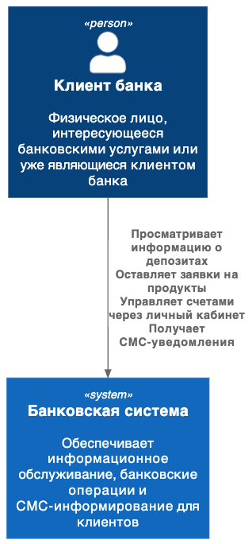
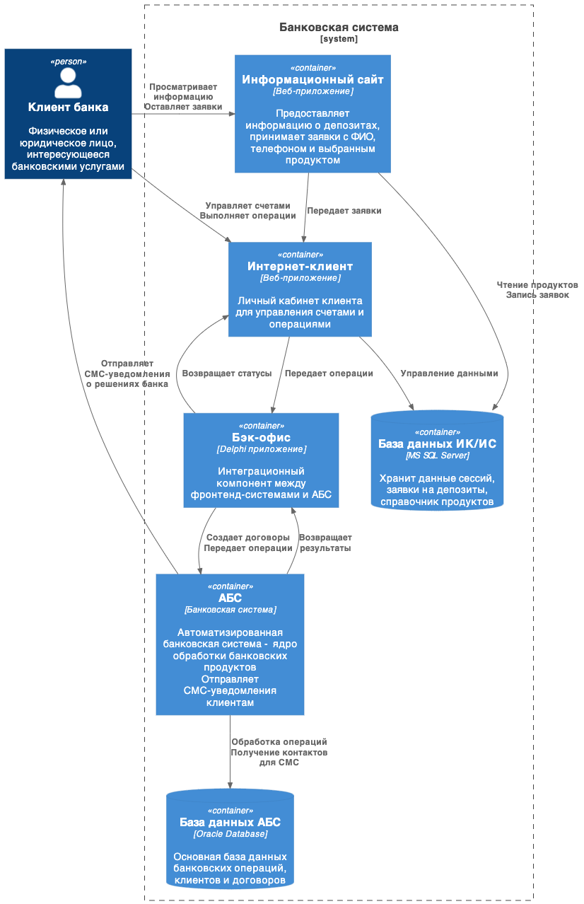

### **Название задачи:** концепт "Депозиты Онлайн"
### **Автор:** Никифоров В.Ю.
### **Дата:** 09.10.2025
### **Функциональные требования**
Верхнеуровневые Use Cases.

|**№**|**Действующие лица или системы**|**Use Case**|**Описание**|
| :-: | :- | :- | :- |
|F1|Любой пользователь|Просмотр страницы депозитов|Отображение текущих ставок банка по депозитам в с минимальным описанием условий|
|F2.1|Любой пользователь|Заполнение базовых данных|Пользователь заполняет форму для заявки на депозит - вводит свое ФИО и номер телефона, выбирает интересующий его продукт|
|F2|Сайт|Валидация, введенных пользователем, данных|Проверка введенной пользователем информации на корректность. Отправка запроса в бэк-офис|
|F3|Интернет-клиент|Отображение персонифицированного списка депозитов|Получение актуальной информации о количестве и остатках по счетам клиента банка. Формирование персонального предложеия на основе данных клиента и текущей рыночной коньюнктуры|
|F4|Интернет-клиент|Процесс отправки заявки на депозит|Проверка корректности выбора атрбутов и отправка запроса на обработку в бэк-офис|
|F5|Интернет-клиент|Отправка СМС-потдтверждения|Отправка СМС-подтверждения операции через СМС-шлюз|
|F6|Бэк-офис|Обработка заявки на депозит|Обработка заявки операционистом и формирование ответа|
|F7|Бэк-офис|Отправка СМС-уведомления|Отсправка уведомления клиенту о решении банка|
### **Нефункциональные требования**
Нефункциональные требования и архитектурно значимые требования.

|**№**|**Требование**|
| :-: | :- |
|R1|Обработка ошибок при отправке СМС|
|R2|Обработка ошибки отсутствия связи с АБС|
|P2|Авторизация пользователя в ИК должна выполняться не более 5000 мс|
|P3|Отправка заявки на депозит (сайт, ИК) должна выполняться не более 1000 мс|
|+R1|Сайт: должен быть доступен только по протоколу HTTPS с поддержкой TLS 1.2 и выше|
|+R2| ИК: должен быть доступен только протоколу HTTPS с поддержкой TLS 1.2 и выше|
### **Решение**
Контекст.

Контейнеры. 

Задача - MVP с реализацией конкретного функционала - автоматизированной обработки запроса на выдачу депозита. Т.е. не трогаем существующий функционал,  не добавляем новые сущности и технологии - акцент на бизнес-задачу. По этому, реализуем web-UI на существующем стеке -  на сайте это PHP+React.JS, в Интернет-клиенте - ASP.NET, обработку на бэке осуществляет движок Интернет-клиента, т.к. у него уже реализован необходимый функционал по связи с АБС (через бэк-офис). 
### **Альтернативы**
Как вариант, реализовать новый отдельный микросеврвис обработки запросов пользователей, перехвтывающий поток от сайта и Интернет-клиента. Но потребуется довольно серьезная переработка существуюего рабочег кода, что для отработки бизнес-решений нецелезсообразно.

**Недостатки, ограничения, риски**
Решение не самое оптимальное по скорости работы ибо на и так не очень быстрый движен бэк Интернет-клиента накладывается дополнительный функционал.
Но, т.к. клиентов банка с желаниемм максимально использовать новые технологи (молодых и технически подготовленных) не так много, данный аспект допустим на этапе MVP.

