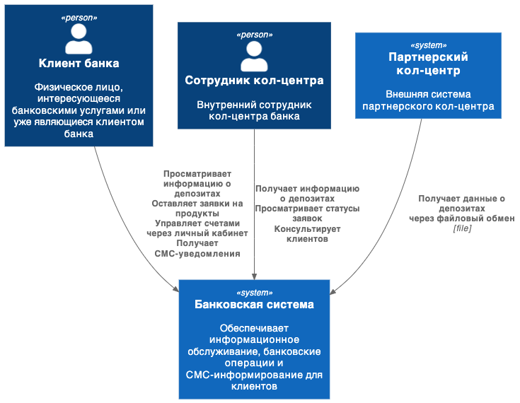
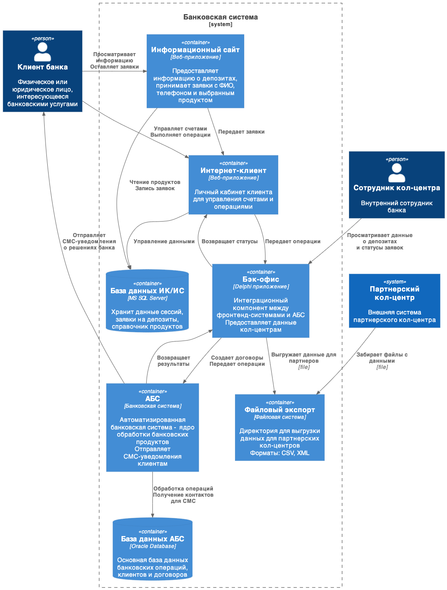

# Архитектурное решение: Концепт "Депозиты Онлайн"

## **Статус**
Принято

## **Название задачи:** концепт "Депозиты Онлайн"
## **Автор:** Никифоров В.Ю.
## **Дата:** 09.10.2025

## **Контекст**
Реализация MVP для автоматизированной обработки запросов на открытие депозитов через цифровые каналы банка с минимальными изменениями в существующей системе.

## **Функциональные требования**

|**№**|**Действующие лица или системы**|**Use Case**|**Описание**|
| :-: | :- | :- | :- |
|F1|Любой пользователь|Просмотр страницы депозитов|Отображение текущих ставок банка по депозитам с минимальным описанием условий|
|F2.1|Любой пользователь|Заполнение базовых данных|Пользователь заполняет форму для заявки на депозит - вводит свое ФИО и номер телефона, выбирает интересующий его продукт|
|F2|Сайт|Валидация введенных пользователем данных|Проверка введенной пользователем информации на корректность. Отправка запроса в бэк-офис|
|F3|Интернет-клиент|Отображение персонифицированного списка депозитов|Получение актуальной информации о количестве и остатках по счетам клиента банка. Формирование персонального предложения на основе данных клиента и текущей рыночной конъюнктуры|
|F4|Интернет-клиент|Процесс отправки заявки на депозит|Проверка корректности выбора атрибутов и отправка запроса на обработку в бэк-офис|
|F5|Интернет-клиент|Отправка СМС-подтверждения|Отправка СМС-подтверждения операции через СМС-шлюз|
|F6|Бэк-офис|Обработка заявки на депозит|Обработка заявки операционистом и формирование ответа|
|F7|Бэк-офис|Отправка СМС-уведомления|Отправка уведомления клиенту о решении банка|
|F8|Кол-центр|Просмотр данных по депозитам|Доступ к информации о продуктах, ставках и заявках через интерфейс бэк-офиса|
|F9|Партнерский кол-центр|Файловый обмен данными|Получение данных о депозитах через выгрузку файлов в согласованном формате|

## **Нефункциональные требования**

|**№**|**Требование**|
| :-: | :- |
|R1|Обработка ошибок при отправке СМС|
|R2|Обработка ошибки отсутствия связи с АБС|
|P1|Сайт, ИК: страницы должны загружаться быстро – миллисекунды. Допустим длительный процесс при аутентификации пользователя ИК|
|+R1|Сайт: должен работать по протоколу HTTPS|
|+R2|ИК: должен работать по протоколу HTTPS|
|+R3|Партнерский кол-центр: обмен данными только через файловый интерфейс|
|+R4|Кол-центр: доступ к данным только через авторизованные каналы бэк-офиса|

## **Решение**

Контекст.

Контейнеры. 

### Технологический стек
- **Информационный сайт**: PHP + React.JS
- **Интернет-клиент**: ASP.NET  
- **Бэк-офис**: Delphi приложение (существующее)
- **Базы данных**: MS SQL Server (ИК/ИС), Oracle Database (АБС)
- **Интеграция**: через существующие каналы связи бэк-офиса с АБС

### Архитектурный подход
MVP с минимальными изменениями в существующей системе. Использование готовых интеграций интернет-клиента с АБС через бэк-офис. Акцент на быструю реализацию бизнес-функциональности.

### Интеграция кол-центров
- **Внутренний кол-центр**: доступ через интерфейсы бэк-офиса
- **Партнерский кол-центр**: файловый обмен (XLSX) на этапе MVP реализуется посредством согласованного формата документа электронной таблицы и пересылкой через почтовые сервисы по адресам, так же определнным на адмнистративном уровне. В дальнейшем, для больше контроля, обмен файлами может быть переведен на внутреннюю почтовую систему, либо ликвидирован путем реализации микросервиса "Документооборот"
- Использование существующих механизмов выгрузки данных из АБС

### Долгосрочная архитектурная цель
Консолидация бэк-офиса (Delphi) и интернет-клиента (ASP.NET) в единую кодовую базу с разделением интерфейсов и системой контроля доступа для сотрудников.

## **Альтернативы**

### Микросервисная архитектура
Создание отдельного микросервиса для обработки депозитных заявок, перехватывающего поток от сайта и интернет-клиента.

**Отклонено по причине:**
- Высокая стоимость переработки существующего кода
- Нецелесообразность для этапа MVP
- Увеличение времени реализации

## **Недостатки, ограничения, риски**

### Текущие риски
- Снижение производительности из-за нагрузки на движок интернет-клиента
- Ограниченная масштабируемость существующей архитектуры
- Файловый обмен с партнерами требует дополнительных процедур безопасности

### Приемлемость рисков
На этапе MVP риски приемлемы из-за ограниченного количества технически подготовленных клиентов и фокуса на отработке бизнес-гипотез.

## **Крупные задачи по системам**

### Консолидация платформ (Долгосрочная цель)
1. **Объединение кодовой базы бэк-офиса и интернет-клиента**
2. **Унифицированная система аутентификации и авторизации** 
3. **Расширенная система контроля доступа** (IP/MAC адреса, геолокация)
4. **Безопасность удаленного доступа сотрудников**

### Информационный сайт (PHP + React.JS)
1. Разработка компонента отображения депозитов
2. Реализация формы заявки на депозит
3. Безопасность и производительность

### Интернет-клиент (ASP.NET)
1. Расширение API для обработки депозитных заявок
2. Разработка персональных предложений
3. СМС-нотификации
4. Подготовка к консолидации с бэк-офисом

### Бэк-офис (Delphi приложение)
1. Модернизация интеграционного слоя
2. Поддержка кол-центров
3. Файловый экспорт для партнеров
4. Подготовка к миграции на ASP.NET

### АБС (Банковская система)
1. Интеграция депозитных продуктов
2. Расширение API
3. Безопасность данных

### Базы данных
1. Модификация схемы данных
2. Миграции данных
3. Подготовка к объединению систем

### Инфраструктура и безопасность
1. Развертывание и мониторинг
2. Безопасность
3. Резервное копирование и восстановление

## **Предварительная оценка сроков**

- **Фаза 1 (2-3 месяца)**: Базовая функциональность сайта и API
- **Фаза 2 (1-2 месяца)**: Интеграция с АБС и СМС-шлюзом  
- **Фаза 3 (1 месяц)**: Поддержка кол-центров и файлового обмена
- **Фаза 4 (1 месяц)**: Тестирование, безопасность, оптимизация
- **Фаза 5 (6-9 месяцев)**: Консолидация бэк-офиса и интернет-клиента

## **Участники решения**

- Разработка: команда интернет-клиента, команда сайта
- Интеграция: команда АБС, команда бэк-офиса
- Безопасность: отдел информационной безопасности
- Бизнес: продукт "Депозиты", кол-центр

## **Следующие шаги**

1. Детализация технических требований
2. Формирование рабочих групп по системам
3. Составление детального плана реализации фаз 1-4
4. Начало разработки MVP